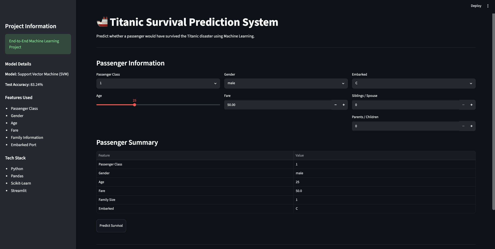

# 🚢 Titanic Survival Prediction System


An end-to-end Machine Learning project that predicts whether a passenger would survive the Titanic disaster based on passenger information.

---

## 📌 Project Overview

This project demonstrates the complete Machine Learning lifecycle, from data exploration to deployment.

The system predicts passenger survival using demographic and travel-related information and provides real-time predictions through an interactive Streamlit application.

---

## 🎯 Problem Statement

Build a machine learning model capable of predicting whether a Titanic passenger would survive based on available passenger information.

### Target Variable

| Value | Meaning |
|---------|---------|
| 1 | Survived |
| 0 | Did Not Survive |

---

## 🖥️ Application Preview

### Streamlit User Interface

> Add your application screenshot below



---

## 📊 Dataset Features

### Original Features

- Passenger Class (Pclass)
- Gender (Sex)
- Age
- Siblings / Spouse Aboard (SibSp)
- Parents / Children Aboard (Parch)
- Fare
- Embarked Port

### Engineered Features

- FamilySize
- IsAlone
- AgeGroup
- FareGroup

---

## 🔍 Exploratory Data Analysis (EDA)

Key observations from the analysis:

✅ Female passengers had significantly higher survival rates.

✅ First-class passengers showed better survival probability.

✅ Higher fare passengers were more likely to survive.

✅ Younger passengers generally had higher survival chances.

✅ Family size influenced survival outcomes.

---

## ⚙️ Machine Learning Workflow

```text
Data Collection
        ↓
Data Cleaning
        ↓
Exploratory Data Analysis
        ↓
Feature Engineering
        ↓
Data Preprocessing
        ↓
Model Training
        ↓
Model Evaluation
        ↓
Model Selection
        ↓
Model Saving
        ↓
Streamlit Deployment
```

---

## 🤖 Models Trained

The following machine learning algorithms were evaluated:

- Logistic Regression
- K-Nearest Neighbors (KNN)
- Naive Bayes
- Decision Tree
- Random Forest
- Support Vector Machine (SVM)
- XGBoost

---

## 🏆 Final Model

### Support Vector Machine (SVM)

**Test Accuracy:** `83.24%`

The baseline SVM model achieved the best performance on the unseen test dataset and was selected as the final deployment model.

---

## 📈 Model Evaluation

Evaluation techniques used:

- Accuracy Score
- Confusion Matrix
- Classification Report
- Cross Validation
- Hyperparameter Tuning

This ensured robust model selection and reduced the risk of overfitting.

---

## 🛠️ Tech Stack

### Programming Language

- Python

### Libraries

- NumPy
- Pandas
- Matplotlib
- Seaborn
- Scikit-Learn
- XGBoost
- Streamlit
- Joblib

---

## 📂 Project Structure

```text
titanic-survival-prediction-system/

│
│── model.pkl
│── scaler.pkl
│── columns.pkl
│
├── titanic_survival_prediction.ipynb
│
├── images/
│   └── app_ui.png
│
├── app.py
├── requirements.txt
├── README.md
└── .gitignore
```

---

## 🚀 Installation

### Clone Repository

```bash
git clone https://github.com/yourusername/titanic-survival-prediction-system.git
```

### Navigate to Project Folder

```bash
cd titanic-survival-prediction-system
```

### Install Dependencies

```bash
pip install -r requirements.txt
```

### Run Application

```bash
streamlit run app.py
```

---

## 🎮 How to Use

1. Select Passenger Class
2. Enter Passenger Details
3. Click **Predict Survival**
4. View Prediction Result
5. Check Survival Probability

---

## ✨ Features

- Interactive Streamlit UI
- Real-Time Predictions
- Feature Engineering Pipeline
- Probability-Based Output
- Saved ML Model Artifacts
- End-to-End Deployment Ready

---

## 🔮 Future Improvements

- SHAP Explainability
- Docker Containerization
- CI/CD Pipeline
- Cloud Deployment Automation
- Advanced Feature Engineering

---

## 👨‍💻 Author

**Shubham Sinha | AI Engineer**

---

## ⭐ If you found this project useful

Consider giving this repository a star.
